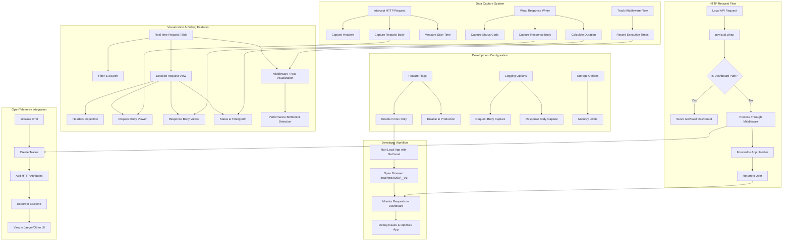
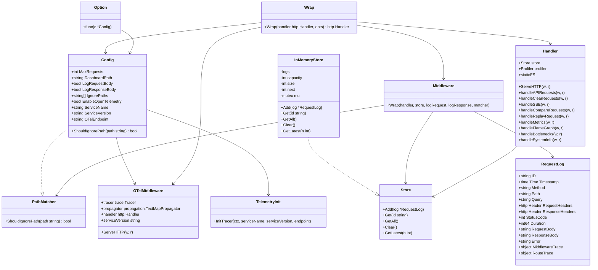

# GoVisual: Core Logic

This document outlines the core logic and architecture of GoVisual, a request visualization tool for Go HTTP applications.

## Overview

GoVisual is designed to be a lightweight, non-intrusive tool that wraps your existing HTTP handlers to provide visibility into request processing. The fundamental design principles include:

1. **Middleware Architecture**: GoVisual uses the HTTP middleware pattern to intercept requests before and after your handler processes them
2. **In-Memory Storage**: All request data is stored in a circular buffer with configurable size
3. **Contextual Enrichment**: The middleware captures detailed execution metrics including timing data
4. **Dashboard Rendering**: A self-contained HTML dashboard for visualizing captured requests
5. **Zero External Dependencies**: No third-party packages required beyond the Go standard library
6. **OpenTelemetry Integration**: Optional integration with OpenTelemetry for distributed tracing

## Request Flow

When a request is processed through GoVisual:

1. The request is intercepted by the GoVisual middleware
2. Request metadata (headers, path, method, body) is captured
3. The original handler is called to process the request
4. Response metadata (status code, headers, body, timing) is captured
5. Both are stored in the in-memory circular buffer
6. The dashboard path (`/__viz` by default) is intercepted to serve the visualization UI
7. If OpenTelemetry is enabled, a trace is created and exported to the configured endpoint

## Core Components

The diagram below illustrates the relationship between core components:

## Technical Architecture

The following class diagram shows the relationships between key components:

## Implementation Details

### Configuration Options

GoVisual can be configured with various options:

- **MaxRequests**: Maximum number of requests to store in memory (default: 100)
- **DashboardPath**: Path to access the dashboard (default: "/\_\_viz")
- **LogRequestBody**: Enable request body logging (default: false)
- **LogResponseBody**: Enable response body logging (default: false)
- **IgnorePaths**: Paths to ignore (default: empty)
- **EnableOpenTelemetry**: Enable OpenTelemetry integration (default: false)
- **ServiceName**: Service name for OpenTelemetry (default: "govisual")
- **ServiceVersion**: Service version for OpenTelemetry (default: "dev")
- **OTelEndpoint**: OTLP exporter endpoint (default: "localhost:4317")

### Circular Buffer Implementation

The in-memory storage uses a circular buffer implementation for efficient memory usage:

1. A fixed-size array holds request logs
2. New logs replace old ones when the buffer is full
3. A pointer tracks the next insertion position
4. A size counter tracks the number of valid entries

This ensures memory usage remains constant regardless of request volume.

### Dashboard Implementation

The dashboard is implemented using a React-based frontend with a Go backend API:

1. React frontend built with Preact and TypeScript, bundled and embedded using Go's `embed` package
2. Server-Sent Events (SSE) provide real-time updates
3. Client-side filtering, sorting, and visualization minimize server load
4. RESTful API endpoints serve JSON data for requests, metrics, and system information
5. Advanced features include flame graphs, performance profiling, and request comparison

### OpenTelemetry Integration

When enabled, GoVisual integrates with OpenTelemetry to provide distributed tracing:

1. Initialize a tracer provider and exporter on startup
2. Create a middleware to wrap HTTP handlers and create spans
3. Add relevant HTTP attributes to spans (method, path, status, etc.)
4. Export traces to the configured endpoint (typically Jaeger or OpenTelemetry Collector)
5. Provide context propagation for distributed tracing

The integration is designed to be optional and non-intrusive, allowing users to benefit from both GoVisual's dashboard and OpenTelemetry's ecosystem.
