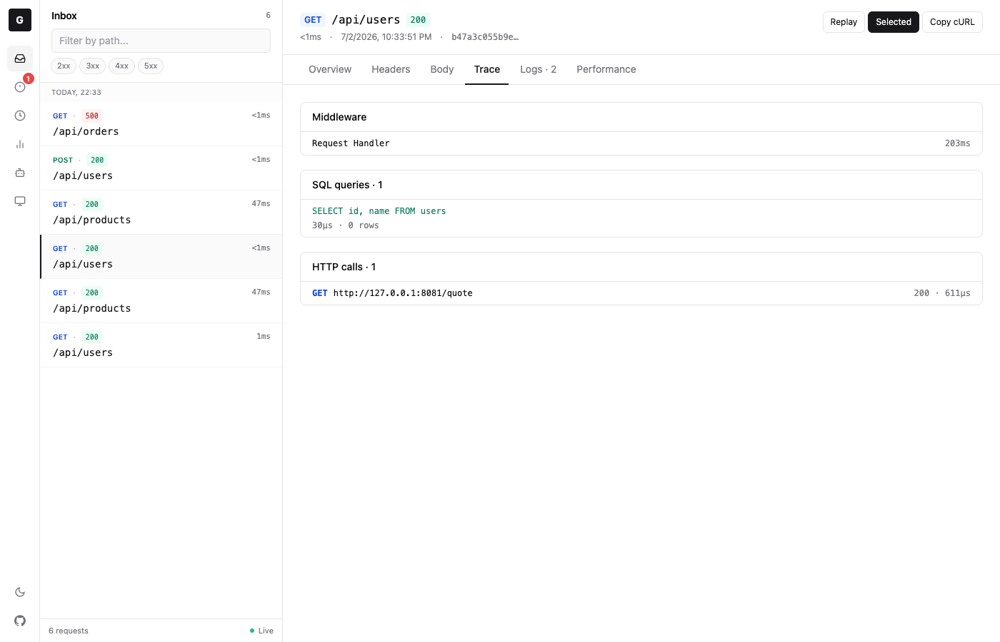

# GoVisual Dashboard

The embedded dashboard is a live view of requests captured by GoVisual v2. It is served by the same handler as your application and does not require a separate process.



## Open the dashboard

The default URL is `http://localhost:<port>/__viz`. To mount it elsewhere:

```go
handler := govisual.Wrap(
	mux,
	govisual.WithDashboardPath("/__debug"),
)
```

Dashboard traffic is loopback-only by default. If you allow remote access, protect it with authentication because captured headers and bodies may contain application data:

```go
handler := govisual.Wrap(
	mux,
	govisual.WithAllowRemote(),
	govisual.WithBasicAuth("admin", os.Getenv("DASHBOARD_PASSWORD")),
)
```

## Views

- **Inbox** shows all captured requests.
- **Errors** includes HTTP 4xx/5xx responses, requests with a recorded `Error`, and captured panics.
- **Slow** shows requests that took at least 200ms.
- **Analytics** summarizes throughput, response classes, latency, and endpoints. JSON/CSV export, client-local JSON import, and clearing the store are available here. Imported rows are temporary UI state and are replaced by the next authoritative live snapshot or reload.
- **Agents** shows recent MCP activity when the same `*store.ActivityLog` is passed to GoVisual and the MCP module.
- **Environment** shows runtime information only when `WithSystemInfo(...)` is enabled. Environment variables are limited to the names you explicitly allowlist.

Use the path search and 2xx/3xx/4xx/5xx chips to narrow the request list. New requests arrive over Server-Sent Events, so the list updates without polling or reloading.

## Request details

Select a request to inspect:

- **Overview**: method, path, status, duration, query, captured error, and panic stack.
- **Headers**: captured request and response headers. Credential-bearing values are redacted at capture time.
- **Body**: request and response bodies when body logging is enabled.
- **Trace**: middleware entries plus instrumented SQL queries and outbound HTTP calls.
- **Logs**: `slog` records and custom events attached to the request context.
- **Performance**: allocation, process, GC, bottleneck, and flame-graph data when profiling is enabled.

Select two or more requests with **Compare** to compare their metadata, bodies, headers, and performance data in selection order.

## Optional data sources

Body capture is off by default:

```go
handler := govisual.Wrap(
	mux,
	govisual.WithRequestBodyLogging(true),
	govisual.WithResponseBodyLogging(true),
)
```

Profiling powers SQL, outbound HTTP, bottleneck, and performance panels:

```go
handler := govisual.Wrap(mux, govisual.WithProfiling(true))
```

Application logs appear when they use a request context and a wrapped handler:

```go
logger := slog.New(govisual.SlogHandler(slog.NewJSONHandler(os.Stdout, nil)))
logger.InfoContext(r.Context(), "loaded account", "account_id", accountID)
```

## Request replay

Replay is disabled by default. Enable it only on a protected dashboard:

```go
handler := govisual.Wrap(
	mux,
	govisual.WithBasicAuth("admin", os.Getenv("DASHBOARD_PASSWORD")),
	govisual.WithReplayEnabled(true),
	govisual.WithReplayBaseURL("http://127.0.0.1:8080"), // required with WithAllowRemote
)
```

The replay endpoint loads the original request by ID. The dashboard can override its method, path, headers, and body, but cannot supply an arbitrary destination URL. The destination is `WithReplayBaseURL(...)` when configured, otherwise a loopback-only dashboard can use its validated origin. Remote dashboards must configure `WithReplayBaseURL(...)`. Replay paths must start with `/`; redirects, host overrides, hop-by-hop headers, content length, and stored redaction markers are not forwarded.

## Troubleshooting

If the dashboard does not load:

1. Confirm the configured dashboard path.
2. Remember that remote clients are rejected unless `WithAllowRemote()` is set.
3. Check that an outer router or authentication middleware is not intercepting the dashboard path.

If requests do not appear:

1. Confirm traffic passes through the handler returned by `govisual.Wrap`.
2. Check `WithIgnorePaths(...)` and `WithSampleRate(...)`.
3. Check the browser network panel for a connected `__viz/api/events` stream.

## Related documentation

- [Configuration options](configuration.md)
- [Request logging](request-logging.md)
- [Middleware tracing](middleware-tracing.md)
- [Storage backends](storage-backends.md)
